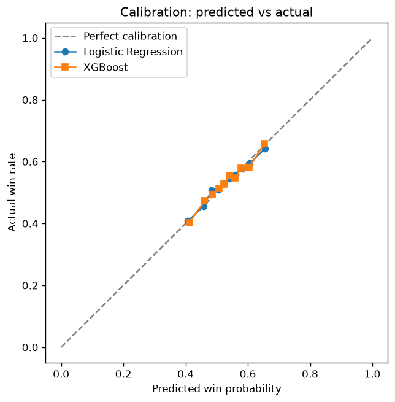
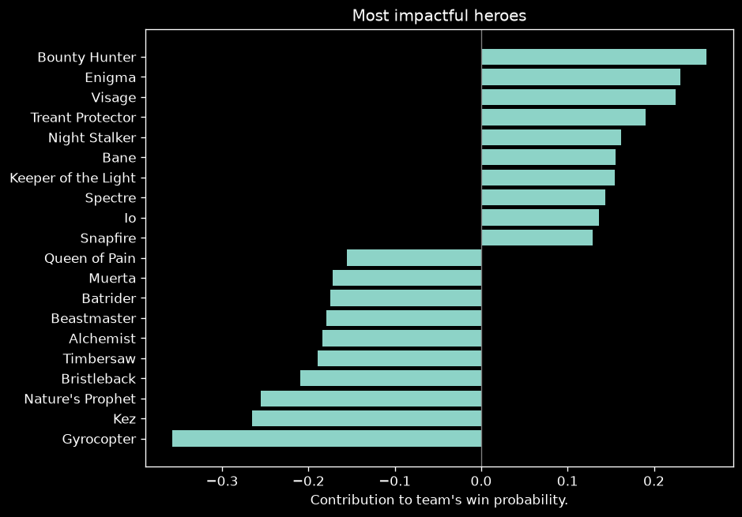

# Dota 2 Hero Pick Helper

Hello, this is a Dota 2 draft win-probability model, predicting match outcome purely from hero drafts alone.

## Overview

The goal is to predict the outcomes of games based on heroes on either Dire or Radiant. This model was created with the goal to suggest what heroes would be great against certain matchups. It is trained on ~150k Divine 1 and above Ranked All Pick matches using data from OpenDota API.

## Results

Draft-only prediction, evaluated on a temporal holdout (train on older
matches, test on newer) to avoid meta-shift leakage.

| Model                             | Test Accuracy |
| --------------------------------- | ------------- |
| Always predict Radiant (baseline) | 53.7%         |
| Logistic Regression               | 55.7%         |
| XGBoost (tuned)                   | 56.0%         |

- Logistic and tuned XGBoost are statistically tied. On raw hero features
  the ceiling is ~56%, and a more complex model does not beat a linear one.
- This points to the *feature representation* as the bottleneck, not the
  model. Adding interaction features (synergy / counter) is the next step.
- Draft contributes ~2.6 points of predictive lift over the side-advantage baseline.
- Model is well-calibrated in the 0.4-0.7 probability range (where ~ 95% of predictions fall)
- This is a draft-only prediction, and it is inherently capped in the mid-50s because skill and in-game execution are not captured.
  
  *Calibration: when the model predicts X% win, radiant wins ~X% of the time.*
- Heroes most associated with winning (top) and losing (bottom) in the dataset. Coefficients reflect win association at Divine rank on the current patch, not absolute hero strength.
  

## Approach

- Data: OpenDota `/publicMatches`, cursor-based pagination, filtered to ranked all-pick (lobby 7, game mode 22), validated for complete drafts
- Features: each match is encoded as a vector: radiant +1, dire -1, over hero slots
- Split: temporal (train on older match IDs, test on newer) to avoid leakage from meta shifts
- Models: logistic-regression baseline and a tuned XGBoost, compared on the same temporal split

## Status

- [X] Data pipeline (OpenDota fetch + validation)
- [X] Baseline model (logistic regression, 55.7%)
- [X] Model comparison (XGBoost, tied at ~56%)
- [ ] Interaction features (synergy / counter)
- [ ] Draft recommender
- [ ] Interactive demo

## How to run

- Firstly after cloning the repo, make sure you are in the dota-draft directory.
- Create and activate a virtual environment.
- Run `pip install -r requirements.txt`, to install necessary libraries.
- Then run `python src/fetch_matches.py`, `python src/build_features.py`, and `python src/train_model.py` (trains the models and writes the plots to `reports/`)
